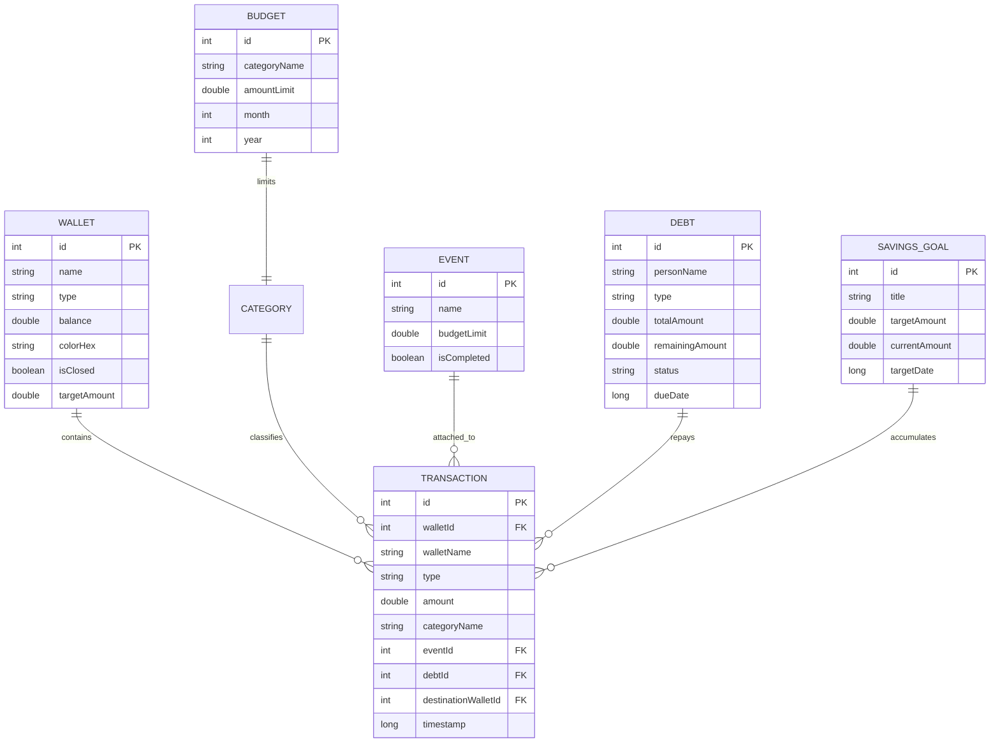
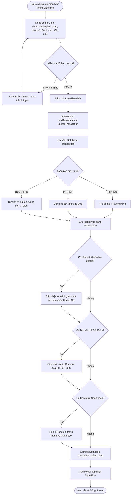
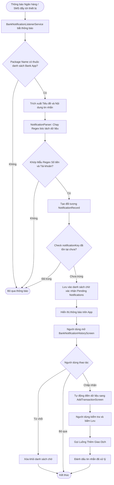
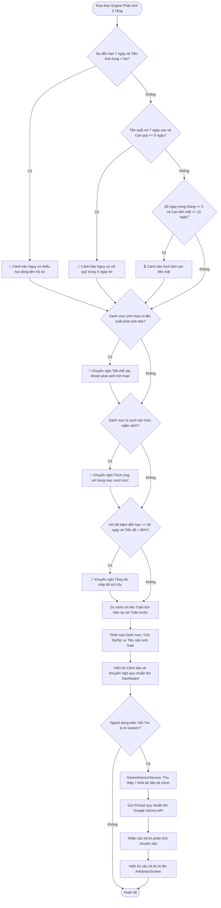
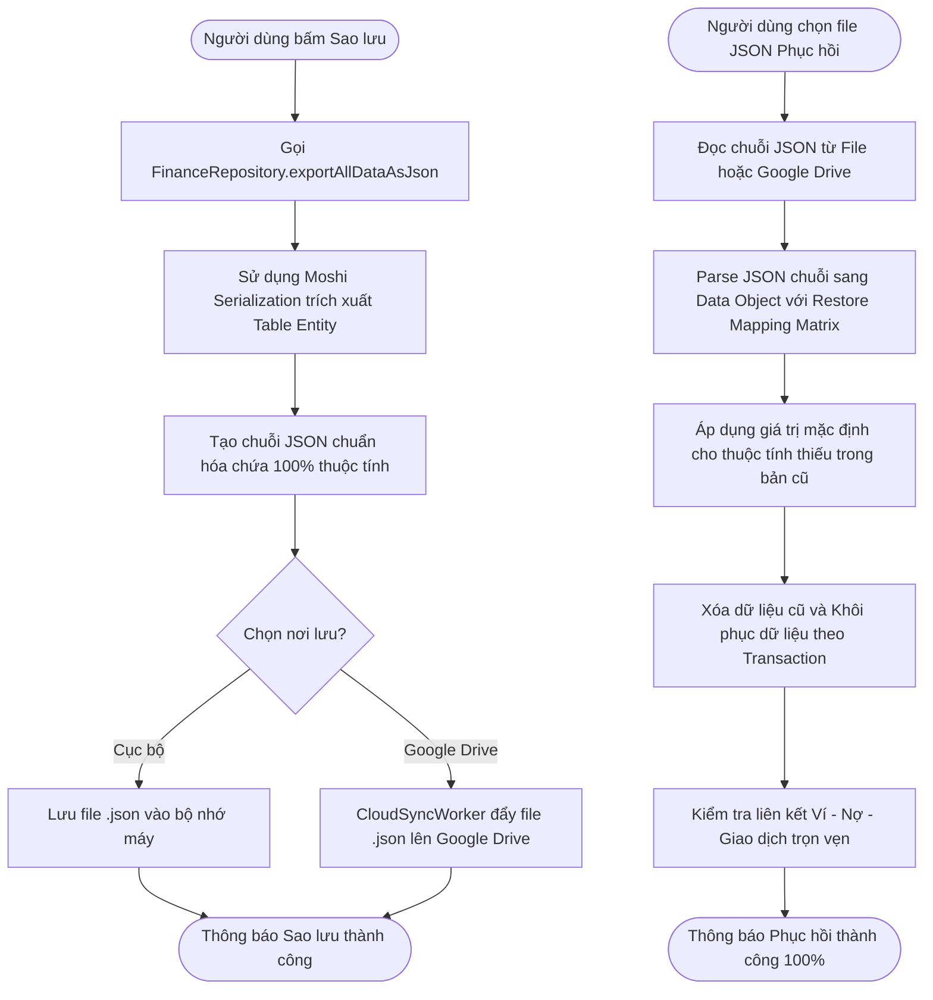
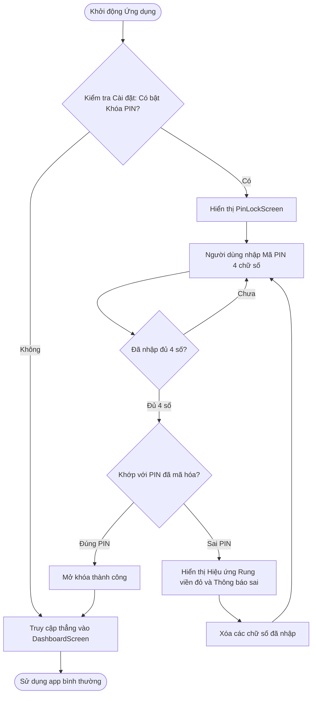

# Sơ Đồ Luồng Hoạt Động Dự Án (Project Flowcharts) - Revenue & Expenditure Management

Tài liệu này tổng hợp toàn bộ sơ đồ luồng (Flowchart) và biểu đồ kiến trúc của ứng dụng **Revenue and Expenditure Management** (Quản lý thu chi cá nhân). Các sơ đồ được vẽ bằng chuẩn [Mermaid](https://mermaid.js.org/) trực quan.

---

## 1. Sơ đồ Kiến trúc Tổng quan Hệ thống (System Architecture Diagram)

Ứng dụng được thiết kế theo mô hình **MVVM (Model - View - ViewModel)** kết hợp kiến trúc **Clean Architecture**:

```mermaid
flowchart TB
    subgraph UI_Layer ["Tầng Giao Diện (Jetpack Compose)"]
        UI_Dash["DashboardScreen (Bảng điều khiển)"]
        UI_Add["AddTransactionScreen (Thêm Giao dịch)"]
        UI_Hist["HistoryScreen và TimelineScreen"]
        UI_Wall["WalletsScreen và WalletManagementScreen"]
        UI_Budg["BudgetGoalScreen (Ngân sách và Tiết kiệm)"]
        UI_Debt["DebtBookScreen (Sổ nợ)"]
        UI_AI["AIAdvisorScreen (Trợ lý AI)"]
        UI_Noti["BankNotificationHistoryScreen"]
        UI_Set["SettingsScreen (Cài đặt, Backup/Restore)"]
        UI_Pin["PinLockScreen (Mật khẩu PIN)"]
        
        UI_Comp["Components: AppModalBottomSheet, CalculatorKeyboard, ColorPicker"]
    end

    subgraph Logic_Layer ["Tầng ViewModel và Services"]
        VM["FinanceViewModel (StateFlow Central)"]
        NotiService["BankNotificationListenerService"]
        NotiParser["NotificationParser"]
        AIService["GeminiAdvisorService"]
        SyncWorker["CloudSyncWorker"]
    end

    subgraph Data_Layer ["Tầng Dữ Liệu (Room Database)"]
        Repo["FinanceRepository"]
        DAO["FinanceDao"]
        DB[("AppDatabase (Room SQLite)")]
        Entities["Entities: Wallet, Transaction, Category, Budget, SavingsGoal, Debt, Event"]
    end

    subgraph External ["Dịch vụ Bên ngoài"]
        GeminiAPI["Google Gemini AI API"]
        GDrive["Google Drive REST API"]
        AndroidNoti["Android System Notification Manager"]
    end

    UI_Dash -->|User Event| VM
    UI_Add -->|User Event| VM
    UI_Hist -->|User Event| VM
    UI_Wall -->|User Event| VM
    UI_Budg -->|User Event| VM
    UI_Debt -->|User Event| VM
    UI_AI -->|User Event| VM
    UI_Noti -->|User Event| VM
    UI_Set -->|User Event| VM

    VM -->|StateFlow| UI_Dash
    VM -->|StateFlow| UI_Add
    VM -->|StateFlow| UI_Hist
    VM -->|StateFlow| UI_Wall
    VM -->|StateFlow| UI_Budg
    VM -->|StateFlow| UI_Debt
    VM -->|StateFlow| UI_AI
    VM -->|StateFlow| UI_Noti
    VM -->|StateFlow| UI_Set

    UI_Layer -.-> UI_Comp

    VM -->|Coroutines / Flow| Repo
    Repo -->|Data| VM
    VM --> AIService
    AIService --> VM

    AndroidNoti -->|Catch Notification| NotiService
    NotiService -->|Parse Text| NotiParser
    NotiParser -->|NotificationRecord| VM
    AIService -->|HTTP Prompt| GeminiAPI
    GeminiAPI -->|Response| AIService
    SyncWorker -->|OAuth2 / Backup JSON| GDrive

    Repo --> DAO
    DAO --> Repo
    DAO --> DB
    DB --> DAO
    DB --- Entities
```

---

## 2. Sơ đồ Quan hệ & Dòng Dữ liệu Thực thể (Entity Relationship Diagram)

---

## 3. Sơ đồ Luồng Thêm/Sửa Giao Dịch & Cập nhật Tự động (Add Transaction Flow)

---

## 4. Sơ đồ Luồng Đọc & Bóc Tách Thông Báo Ngân Hàng (Bank Notification Scanning Flow)

---

## 5. Sơ đồ Bộ Máy AI Tư Vấn Tài Chính 3 Tầng & Gemini API (Context-Aware AI Advisor Engine)

---

## 6. Sơ đồ Luồng Bảo Toàn Dữ Liệu & Sao Lưu / Phục Hồi (Lossless Backup & Restore Flow)

---

## 7. Sơ đồ Luồng Khóa & Bảo Mật Ứng Dụng bằng Mã PIN (PIN Code Authentication Flow)

