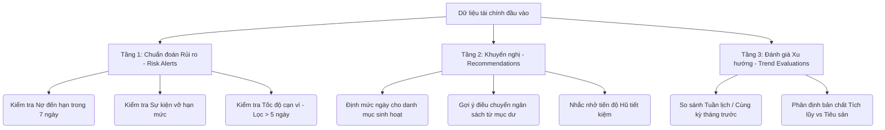

# Đặc tả Tiêu chuẩn Logic Tài chính & Bảo toàn Dữ liệu (Smart Financial Logic & Lossless Data Specs)

Tài liệu này là **Tiêu chuẩn vàng (Golden Reference)** của dự án **Revenue and Expenditure Management**, quy định các công thức toán học, nguyên tắc toàn vẹn dữ liệu, và logic chuẩn đoán của Trợ lý AI Tài chính. Mọi tính năng phát triển mới, viết Unit Test hoặc refactor code **bắt buộc** phải tuân thủ nghiêm ngặt các quy chuẩn dưới đây.

---

## 1. Tiêu chuẩn Toàn vẹn Dữ liệu & Backup/Restore (Lossless Data Management)

### 1.1 Nguyên tắc Nguồn Chân lý Duy nhất (Single Source of Truth cho Export)
* **Quy chuẩn:** Toàn bộ các luồng xuất dữ liệu (Backup cục bộ xuống máy, đồng bộ lên Google Drive, hay chuyển đổi JSON) **bắt buộc phải gọi hàm `FinanceRepository.exportAllDataAsJson()`** (dùng `Moshi` tự động serialization).
* **Cấm:** Tuyệt đối không viết code thủ công kiểu `JSONObject.put(...)` hay `JSONArray.put(...)` trong ViewModel hoặc bất kỳ màn hình nào để tránh nguy cơ rò rỉ và mất cột dữ liệu mỗi khi Database có migration mới.

### 1.2 Bảng Đối chiếu Khôi phục Dữ liệu (Restore Mapping Matrix - `performRestoreFromJsonString`)
Khi parse file JSON để khôi phục vào Room Database, thuật toán restore phải đảm bảo đọc và khôi phục trọn vẹn 100% các thuộc tính, bao gồm cả các thuộc tính mới được thêm vào qua các lần migration:

| Entity | Thuộc tính (Property) | Giá trị mặc định nếu JSON cũ không có | Ý nghĩa / Ghi chú |
| :--- | :--- | :--- | :--- |
| **Wallet** | `id`, `name`, `type`, `balance`, `colorHex`, `iconName`, `displayOrder` | Mặc định theo constructor | Các trường cơ bản của ví |
| | `createdAt` | `System.currentTimeMillis()` | Thời điểm tạo ví (Migration 7 -> 8) |
| | `isClosed` | `false` | Trạng thái đóng/mở ví (Migration 8 -> 9). **Quy tắc:** Ví bị khóa phải giữ nguyên trạng thái khóa khi restore. |
| | `targetAmount` | `null` | Mục tiêu số tiền cần đạt của Hũ tiết kiệm (Migration 9 -> 10). |
| **Transaction** | `id`, `walletId`, `walletName`, `type`, `amount`, `categoryName`, `categoryIcon`, `categoryColor`, `note`, `timestamp`, `isRecurring`, `recurrencePeriod`, `eventId`, `destinationWalletId` | Mặc định theo constructor | Các trường cơ bản của giao dịch |
| | `debtId` | `null` | ID khoản nợ/cho vay liên quan (Migration 10 -> 11). **Quy tắc tối thượng:** Không được làm mất `debtId` để tránh giao dịch bị đứt gãy khỏi lịch sử thanh toán nợ. |
| | `notificationKey` | `null` | Khóa chống trùng lặp tin nhắn SMS (Migration 11 -> 12). |
| **Debt** | `id`, `personName`, `type`, `totalAmount`, `remainingAmount`, `walletId`, `creationDate`, `dueDate`, `note`, `status` | Mặc định theo constructor | Các trường cơ bản của khoản nợ |
| | `repaymentType` | `"FLEXIBLE"` | Hình thức trả nợ (FLEXIBLE, ONE_TIME, INSTALLMENT...) (Migration 6 -> 7) |
| | `periodicAmount` | `null` | Số tiền trả định kỳ |
| | `periodType` | `null` | Chu kỳ trả định kỳ (MONTHLY, WEEKLY...) |

### 1.3 Tiêu chuẩn Báo cáo CSV/Excel (`ExcelExportHelper`)
* **Phân loại giao dịch chuẩn:** 
  * `EXPENSE` $\rightarrow$ `"Chi tiêu"`
  * `INCOME` $\rightarrow$ `"Thu nhập"`
  * `TRANSFER` $\rightarrow$ `"Chuyển tiền"` *(Cấm hiển thị nhầm thành Thu nhập)*
* **Cột bắt buộc mở rộng:** Trong báo cáo CSV phải có cột **"Tên Sự kiện (Event)"** và **"Khoản nợ/Cho vay (Debt)"** để ánh xạ đúng ngữ cảnh chi tiêu của người dùng.

---

## 2. Tiêu chuẩn Thuật toán Phân tích Chi tiêu Thông minh 2.0 (Context-Aware Advisor Engine)

Hệ thống AI Advisor trên trang chủ hoạt động theo bộ máy logic 3 tầng (3-Layer Engine): **Chuẩn đoán Rủi ro (Risk Alerts)** $\rightarrow$ **Khuyến nghị Hành động (Recommendations)** $\rightarrow$ **Đánh giá Xu hướng (Trend Evaluations)**.

### 2.1 Tầng 1: Chuẩn đoán Rủi ro (Risk Alerts Engine - Tiên đoán Tương lai từ Thói quen & Tần suất)
Hệ thống không cảnh báo những việc "đã rồi" (như đã vượt hạn mức), mà tập trung **tiên đoán các kịch bản xấu trong tương lai** nếu người dùng vẫn giữ thói quen và tần suất chi tiêu hiện tại. Lấy tối đa **2 cảnh báo nghiêm trọng nhất**:

#### 🚨 Rủi ro 1: Thiếu hụt dòng tiền trả nợ gối đầu (Cashflow Overdraft Risk) — *Độ ưu tiên: Cao nhất*
* **Điều kiện:** Tìm tất cả các khoản nợ phải trả (`Debt.type == "DEBT"` và `status == "ACTIVE"`) có ngày đáo hạn (`dueDate`) trong vòng **7 ngày tới** ($\text{Now} \le \text{dueDate} \le \text{Now} + 7 \times 24 \times 3600 \times 1000\text{ms}$).
* **Công thức:**
  $$\text{AvailableCash} = \sum (\text{Wallet.balance where type } \notin \{\text{CREDIT}, \text{SAVINGS}\})$$
  $$\text{TotalDebtDue7Days} = \sum \text{Debt.remainingAmount (trong 7 ngày tới)}$$
  $$\text{NetCashAfterDebt} = \text{AvailableCash} - \text{TotalDebtDue7Days}$$
* **Hành động:** Nếu $\text{NetCashAfterDebt} < 0$:
  * **Tiêu đề:** `🚨 Nguy cơ thiếu hụt dòng tiền trả nợ!`
  * **Mô tả:** `Trong 7 ngày tới bạn có khoản nợ [X đồng] sắp đến hạn, nhưng số dư khả dụng hiện tại chỉ có [Y đồng]. Hãy chuẩn bị nguồn tiền ngay!`
  * **Màu sắc:** Đỏ báo động (`#D32F2F`), Icon: `Warning`.

#### ⚠️ Rủi ro 2: Thói quen chi tiêu dồn dập có nguy cơ vỡ quỹ (Habit & Frequency Overspend Risk) — *Độ ưu tiên: Cao*
* **Điều kiện:** Quét các hạng mục trong tháng chưa vượt hạn mức ($\text{Spent} < \text{Limit}$ hoặc chưa đặt hạn mức) nhưng có tần suất chi tiêu dày đặc trong 7 ngày gần nhất ($\text{Freq7d} \ge 4$ giao dịch/tuần).
* **Công thức:**
  $$\text{DailyBurnRate} = \frac{\text{Spent7d}}{7.0}$$
  $$\text{DaysToExhaust} = \frac{\text{Limit} - \text{Spent}}{\text{DailyBurnRate}}$$
* **Hành động:** Nếu $\text{DaysToExhaust} \le 5$ ngày (và trước thời điểm kết thúc tháng):
  * **Tiêu đề:** `🚨 Nguy cơ vỡ quỹ '[Tên mục]' trong [X] ngày tới!`
  * **Mô tả:** `Với tần suất chi tiêu dồn dập ([N] lần trong tuần qua) và nhịp độ [Y đồng/ngày], quỹ '[Tên mục]' sẽ bị cạn trước khi hết tháng. Bạn cần lưu ý điều chỉnh nhịp chi tiêu!`
  * **Màu sắc:** Cam đỏ (`#E57373`), Icon: `TrendingUp`.

#### ⏳ Rủi ro 3: Kịch bản cạn kiệt tài khoản từ nhịp chi tiêu hiện tại (Future Cashburn Scenario) — *Độ ưu tiên: Trung bình*
* **Quy tắc Bảo vệ Đầu tháng (Anti-Distortion Filter):** Tuyệt đối không áp dụng tính toán rủi ro cạn tiền nếu số ngày đã trôi qua trong tháng $< 5$ ngày ($\text{DaysElapsed} < 5$).
* **Công thức (Áp dụng khi $\text{DaysElapsed} \ge 5$ và $\text{AvailableCash} > 0$):** Dựa trên tổng chi 7 ngày qua ($\text{Total7d}$), tính nhịp độ tiêu trung bình $\text{DailySpend} = \frac{\text{Total7d}}{7.0}$.
  $$\text{DaysToDry} = \frac{\text{AvailableCash}}{\text{DailySpend}}$$
* **Hành động:** Nếu $\text{DaysToDry} \le 10$ ngày:
  * **Tiêu đề:** `⏳ Kịch bản cạn tiền mặt sau [X] ngày tới`
  * **Mô tả:** `Dựa trên thói quen chi ra khoảng [Y đồng/ngày] gần đây, số dư tiền mặt hiện tại có nguy cơ cạn kiệt trước thời điểm cuối tháng nếu không tiết chế.`
  * **Màu sắc:** Cam cảnh báo (`#F44336`), Icon: `TrendingDown`.

---

### 2.2 Tầng 2: Khuyến nghị Hành động (Actionable Recommendations - Tiết chế Chi phí Phát sinh)
Tuyệt đối không khuyến nghị "đập chỗ này vào chỗ kia" (lấy ngân sách mục này bù mục khác). Việc vượt hạn mức một danh mục là bình thường nếu do nhu cầu thực tế; khuyến nghị cần tập trung vào việc **giảm chi phí phát sinh linh hoạt** và **tiết chế thói quen sinh hoạt** để không tiêu tốn quá nhiều.

#### 💡 Khuyến nghị 1: Tiết chế tần suất chi phí phát sinh linh hoạt (Discretionary Frequency Control) — *Đột phá*
* **Logic:** Nhận diện các danh mục chi tiêu linh hoạt/phát sinh thường nhật (như `"Ăn uống"`, `"Cà phê"`, `"Mua sắm"`, `"Giải trí"`, `"Di chuyển"`, `"Siêu thị"`, `"Shopping"`) đang có tần suất phát sinh cao hoặc chiếm tỷ trọng lớn.
* **Hành động:**
  * **Tiêu đề:** `💡 Tiết chế các khoản phát sinh '[Tên mục]'`
  * **Mô tả:** `Hạng mục '[Tên mục]' đang có tần suất phát sinh khá dày ([N] lần trong tháng). Bạn nên giảm bớt các khoản chi nhỏ lẻ không thiết yếu để duy trì nhịp chi tiêu dưới [X đồng/ngày] cho đến hết tháng.`
  * **Màu sắc:** Vàng cam (`#FFB300`), Icon: `Lightbulb`.

#### 📌 Khuyến nghị 2: Thích ứng với hạng mục vượt mức (Overspending Adaptation)
* **Logic:** Khi một danh mục bị vượt hạn mức ($\text{Spent} > \text{Limit}$), ghi nhận đây là thực tế bình thường và đưa ra lời khuyên thích ứng cho tổng thể dòng tiền.
* **Hành động:**
  * **Tiêu đề:** `📌 Thích ứng với hạng mục vượt mức '[Tên mục]'`
  * **Mô tả:** `Việc vượt hạn mức '[Tên mục]' ([X đồng]) là bình thường nếu do nhu cầu thực tế. Tuy nhiên, từ nay đến cuối tháng, hãy ưu tiên cắt giảm các chi phí phát sinh linh hoạt khác để tổng thể ngân sách tháng không bị ảnh hưởng.`
  * **Màu sắc:** Xanh lam hoặc Vàng (`#FFA000`), Icon: `Info`.

#### 🎯 Khuyến nghị 3: Nhịp độ tích lũy cho Hũ tiết kiệm (Savings Goal Pacing)
* **Logic:** Quét các Hũ tiết kiệm (`SavingsGoal`) có ngày mục tiêu (`targetDate`) nằm trong **30 ngày tới**. Nếu tiến độ $\frac{\text{currentAmount}}{\text{targetAmount}} < 0.8$ (dưới $80\%$):
* **Hành động:**
  * **Tiêu đề:** `🎯 Tăng tốc mục tiêu '[Tên Hũ]'`
  * **Mô tả:** `Chỉ còn [X ngày] nữa là đến hạn mục tiêu, bạn cần tích lũy thêm [Y đồng]. Hãy cố gắng tiết kiệm nhé!`
  * **Màu sắc:** Xanh lục (`#4CAF50`), Icon: `Lightbulb`.

---

### 2.3 Tầng 3: Đánh giá Xu hướng (Smart Trend Evaluations)
* **Quy tắc Tuần lịch (Calendar Week Window):** 
  * Tuần này ($\text{CurrentWeek}$): Từ 00:00:00 Thứ 2 của tuần hiện tại đến thời điểm hiện tại.
  * Tuần trước ($\text{PreviousWeek}$): Từ 00:00:00 Thứ 2 tuần trước đến 23:59:59 Chủ nhật tuần trước.
* **Quy tắc Phân định Bản chất Chi tiêu (Smart Categorization):**
  * **Nhóm Tích lũy / Trả nợ (Good Spending):** Các danh mục chứa từ khóa `"Trả nợ"`, `"Tiết kiệm"`, `"Đầu tư"`, `"Bảo hiểm"`, `"Học tập"`.
    * *Quy tắc:* Nếu chi tiêu nhóm này tăng $\ge 20\%$ so với tuần trước $\rightarrow$ **Khen ngợi** (*"🌟 Tốt lắm! Bạn đã gia tăng ngân sách cho việc tích lũy/trả nợ thêm [X%] so với tuần trước"*).
  * **Nhóm Tiêu sản / Sinh hoạt (Regular Expense):** Các danh mục còn lại.
    * *Quy tắc:* Nếu giảm $\ge 20\%$ $\rightarrow$ **Khen ngợi** (*"🎉 Chúc mừng! Bạn đã cắt giảm thành công chi phí '[Tên]' đi [X%] so với tuần trước"*). Nếu tăng $\ge 35\%$ $\rightarrow$ **Cảnh báo nhẹ** (*"📈 Chi phí '[Tên]' đang tăng [X%] so với tuần trước. Cần chú ý rà soát"*).

---

## 3. Tiêu chuẩn Tích hợp Trợ lý AI Gemini (`GeminiAdvisorService`)

Khi xây dựng prompt gửi lên Google Gemini API để lấy lời khuyên tài chính chuyên sâu, chuỗi `prompt` **bắt buộc** phải hội tụ đủ 7 khối thông tin:
1. `Wallets Info`: Danh sách ví cùng số dư và trạng thái (`isClosed`).
2. `Monthly Summary`: Tóm tắt thu chi tháng này vs tháng trước.
3. `Top Expenses`: 5 khoản chi tiêu lớn nhất trong tháng.
4. `Debts Info`: Danh sách các khoản vay/nợ cùng ngày đáo hạn và trạng thái.
5. `Budgets Info`: Tình trạng hạn mức và số tiền đã chi.
6. **`Events Info` (Mới bắt buộc):** Danh sách các Sự kiện đang diễn ra, hạn mức sự kiện và số tiền đã chi cho sự kiện đó.
7. **`Savings Goals Info` (Mới bắt buộc):** Danh sách Hũ tiết kiệm, số tiền hiện có, mục tiêu và ngày đến hạn.

---

## 4. Kiểm thử Kiểm chứng Logic (Test Cases Reference)

Khi chạy kiểm thử hệ thống hoặc debug, sử dụng bảng Test Cases chuẩn dưới đây:

| Mã TC | Tên Kiểm thử | Kịch bản Dữ liệu (Input) | Kết quả Kỳ vọng (Expected Output) |
| :--- | :--- | :--- | :--- |
| **TC_01** | Khôi phục Ví bị khóa và Hũ tiết kiệm | 1 Ví Khóa (`isClosed = true`), 1 Ví Tiết kiệm có `targetAmount = 10000000`. Xuất JSON -> Xóa sạch DB -> Restore JSON. | Ví Khóa vẫn giữ trạng thái `isClosed = true` (không bị tự động mở lại). Ví Tiết kiệm vẫn giữ `targetAmount = 10000000`. |
| **TC_02** | Khôi phục liên kết Giao dịch Trả nợ | 1 Giao dịch có `debtId = 5`. Xuất JSON -> Xóa sạch DB -> Restore JSON. | Giao dịch sau khi restore vẫn có `debtId == 5`. Lịch sử của Khoản nợ số 5 vẫn hiển thị giao dịch này. |
| **TC_03** | Cảnh báo nợ đáo hạn gối đầu | Ví khả dụng: 4,000,000đ. Khoản nợ phải trả trong 3 ngày tới: 6,000,000đ. | Trang chủ hiển thị ngay Cảnh báo rủi ro số 1: *"🚨 Nguy cơ thiếu hụt dòng tiền trả nợ! Trong 7 ngày tới có khoản nợ 6,000,000đ sắp đến hạn..."* |
| **TC_04** | Bộ lọc cạn ví ngày đầu tháng | Ngày hệ thống: Ngày 2 trong tháng. Thêm giao dịch trả tiền nhà 15,000,000đ. Ví khả dụng: 30,000,000đ. | Trang chủ **KHÔNG** hiển thị cảnh báo "Tài khoản sắp cạn tiền trong 2 ngày tới" (Do bộ lọc chặn $< 5$ ngày đầu tháng). |
| **TC_05** | Khuyến nghị thích ứng khi vượt hạn mức | Ngân sách Ăn uống vượt 500,000đ. Các chi phí linh hoạt khác đang có tần suất cao. | Trang chủ hiển thị Khuyến nghị: *"📌 Thích ứng với hạng mục vượt mức 'Ăn uống': Việc vượt hạn mức (500,000đ) là bình thường nếu do nhu cầu thực tế. Tuy nhiên, từ nay đến cuối tháng, hãy ưu tiên cắt giảm các chi phí phát sinh linh hoạt khác..."* |
