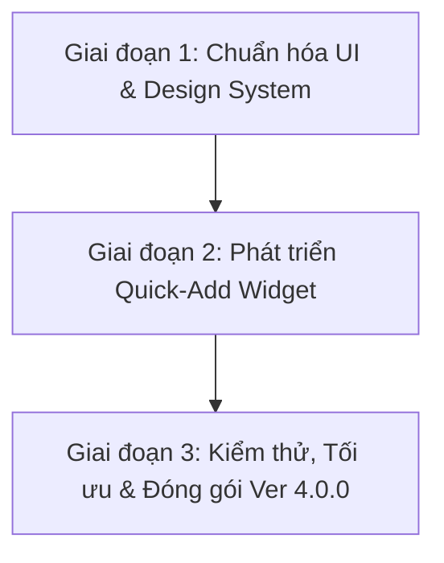

# KẾ HOẠCH PHÁT TRIỂN & CẬP NHẬT PHIÊN BẢN VER 4.0.0

Dự án: **Quản Lý Chi Tiêu (Finance Manager)**  
Mục tiêu chính: Tập trung tối đa vào **Trải nghiệm Ghi chép Dòng tiền Nhanh chóng** và **Nâng cấp Giao diện UI/UX Hiện đại, Đồng nhất**.

---

## 🎯 HAI TRỤ CỘT CHÍNH TRONG BẢN CẬP NHẬT VER 4.0.0

---

### 🟢 1. PHÁT TRIỂN WIDGET THÊM NHANH NGOÀI MÀN HÌNH CHÍNH (QUICK-ADD WIDGET)

#### 🎯 Mục tiêu:
Giúp người dùng ghi chép nhanh giao dịch thu/chi ngay lập tức từ màn hình chính của điện thoại Android mà không cần phải mở ứng dụng qua nhiều thao tác.

#### 🛠️ Chi tiết kỹ thuật & Tính năng của Widget:
- **Công nghệ triển khai:**
  - Sử dụng **Jetpack Glance** (chuẩn mới nhất của Android cho AppWidget bằng Jetpack Compose) kết hợp với `RemoteViews` / `AppWidgetProvider`.
- **Thiết kế Widget ngoài Màn hình chính:**
  - **Kích thước linh hoạt:** Tương thích các size Widget ($2\times2$, $4\times1$, $4\times2$).
  - **Nút bấm 1 chạm (Quick Actions):**
    - ➖ **Thêm Chi tiêu (-)** $\rightarrow$ Mở thẳng màn hình nhập liệu với mode Chi tiêu được chọn sẵn.
    - ➕ **Thêm Thu nhập (+)** $\rightarrow$ Mở thẳng màn hình nhập liệu với mode Thu nhập.
    - 🔄 **Chuyển tiền** $\rightarrow$ Mở thẳng mode Chuyển khoản giữa các ví.
  - **Hiển thị thông tin nhanh (Quick Info Display):**
    - Xem số dư tổng hiện tại / Số dư Ví chính.
    - Tổng thu & tổng chi trong ngày hôm nay.
- **Tích hợp Deep-Link & PendingIntent:**
  - Chuyển hướng tức thì người dùng đến `AddTransactionScreen` với tham số khởi tạo sẵn (danh mục mặc định, ví mặc định) giúp rút ngắn thời gian nhập liệu xuống còn **dưới 3 giây**.

---

### 🎨 2. TỐI ƯU HÓA & NÂNG CẤP THIẾT KẾ GIAO DIỆN (UI/UX MODERNIZATION)

#### 🎯 Mục tiêu:
Đưa giao diện ứng dụng lên tiêu chuẩn hiện đại, sang trọng, mang lại cảm giác cực kỳ mượt mà, đồng thời **tân tuân nghiêm ngặt các quy chuẩn thiết kế của dự án (Workspace Rules)**.

#### 📐 Chi tiết nâng cấp Giao diện:

##### A. Chuẩn hóa Header & TopAppBar (`AppHeader`)
- **Đồng nhất 100% giao diện TopAppBar:**
  - Bọc tất cả `TopAppBar` trên toàn bộ các màn hình trong `Surface`: `modifier = Modifier.fillMaxWidth()`, `color = MaterialTheme.colorScheme.surface`, `shadowElevation = 3.dp`, `tonalElevation = 1.dp`.
  - Chuẩn hóa chữ tiêu đề (Title): `fontWeight = FontWeight.Black`, `fontSize = 20.sp`, `letterSpacing = 0.5.sp`, `color = MaterialTheme.colorScheme.onSurface`.

##### B. Tối ưu Hệ thống Màu sắc & Theme (Material 3 Dynamic Theme)
- Ưu tiên 100% việc tận dụng biến màu từ `MaterialTheme.colorScheme` (`primary`, `secondary`, `surfaceContainer`, `onSurface`, `error...`) để tương thích hoàn hảo giữa **Dark Mode** và **Light Mode**.
- Loại bỏ các mã màu HEX hard-code không cần thiết, chuyển sang màu sắc có độ tương phản cao, hiện đại và dịu mắt.

##### C. Chuẩn hóa ModalBottomSheet (`AppModalBottomSheet`)
- Tất cả các hộp thoại vuốt từ dưới lên (Modal Bottom Sheet) ở toàn bộ các màn hình bắt buộc sử dụng duy nhất component chung `AppModalBottomSheet` ([com.app.ui.components.AppModalBottomSheet](file:///d:/coding/revenue-and-expenditure-management/app/src/main/java/com/app/ui/components/AppModalBottomSheet.kt)):
  - **Header:** Tiêu đề (`20.sp`, `FontWeight.Black`), nút đóng `(X)` cố định + nút hành động bổ sung nếu có, kèm `HorizontalDivider`.
  - **Content:** Nội dung cuộn linh hoạt.
  - **Footer:** Chứa nút Hủy / Thực thi chính.
  - Cấu hình `sheetState = rememberModalBottomSheetState(skipPartiallyExpanded = true)`.

##### D. Chuẩn hóa Validation Form (Kiểm tra nhập liệu)
- Tất cả các ô nhập liệu (Input Form tại màn hình Thêm giao dịch, Thêm ví, Thêm hạn mức, v.v.):
  - Hiển thị thông báo lỗi rõ ràng bên dưới ô bị sai (`supportingText = { Text("...", color = MaterialTheme.colorScheme.error) }`).
  - Nổi bật ô nhập bị lỗi bằng thuộc tính `isError = true` (viền đỏ nổi bật).

##### E. Nâng cấp Trải nghiệm Tương tác (UX & Micro-animations)
- Bổ sung hiệu ứng chuyển cảnh mượt mà giữa các tab và màn hình.
- Thêm hiệu ứng gợn sóng (ripple effect), phản hồi rung nhẹ (Haptic feedback) khi thêm/sửa/xóa giao dịch thành công.
- Tối ưu khoảng cách (padding/margin), góc bo tròn (`RoundedCornerShape`), độ cao shadow của các thẻ Card (Dashboard, History, Wallets).

---

## 🗓️ LỘ TRÌNH THỰC HIỆN ĐỀ XUẤT (IMPLEMENTATION PHASES)

### 📍 Giai đoạn 1: Rà soát & Chuẩn hóa Giao diện UI (UI Refactoring)
1. Rà soát lại toàn bộ 16 màn hình trong `com.app.ui.screens` để đảm bảo tuân thủ `AppHeader`, `AppModalBottomSheet` và `Form Validation`.
2. Tối ưu Theme, màu sắc Dark/Light mode và căn chỉnh layout/card cho chuẩn thẩm mỹ hiện đại.

### 📍 Giai đoạn 2: Phát triển Quick-Add Widget (Widget Thêm Nhanh)
1. Thêm thư viện `androidx.glance:glance-appwidget` vào `build.gradle.kts`.
2. Tạo `QuickAddWidget.kt` và `QuickAddWidgetReceiver.kt`.
3. Thiết kế giao diện Widget ngoài màn hình chính (các nút Thu/Chi/Chuyển khoản, số dư tổng).
4. Cấu hình DeepLink khởi chạy `AddTransactionScreen` với dữ liệu tham số tương ứng.
5. Đăng ký Widget trong `AndroidManifest.xml` và tạo file cấu hình `xml/quick_add_widget_info.xml`.

### 📍 Giai đoạn 3: Kiểm thử & Hoàn thiện (Testing & Release)
1. Kiểm thử hiển thị Widget trên các kích thước màn hình Android khác nhau.
2. Kiểm thử hoạt động mượt mà của Widget khi bấm chuyển thẳng vào ứng dụng.
3. Đóng gói bản Release Ver 4.0.0.

---
*Kế hoạch đã được lưu giữ tại: `version_release/v4_update_plan.md`*
